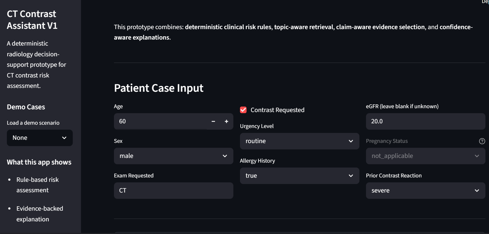
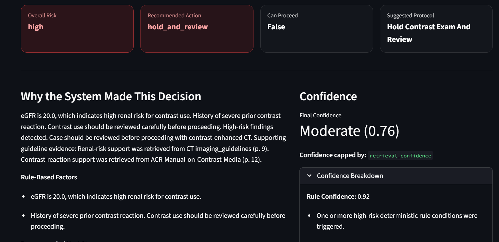
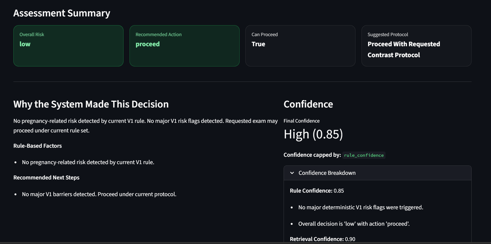
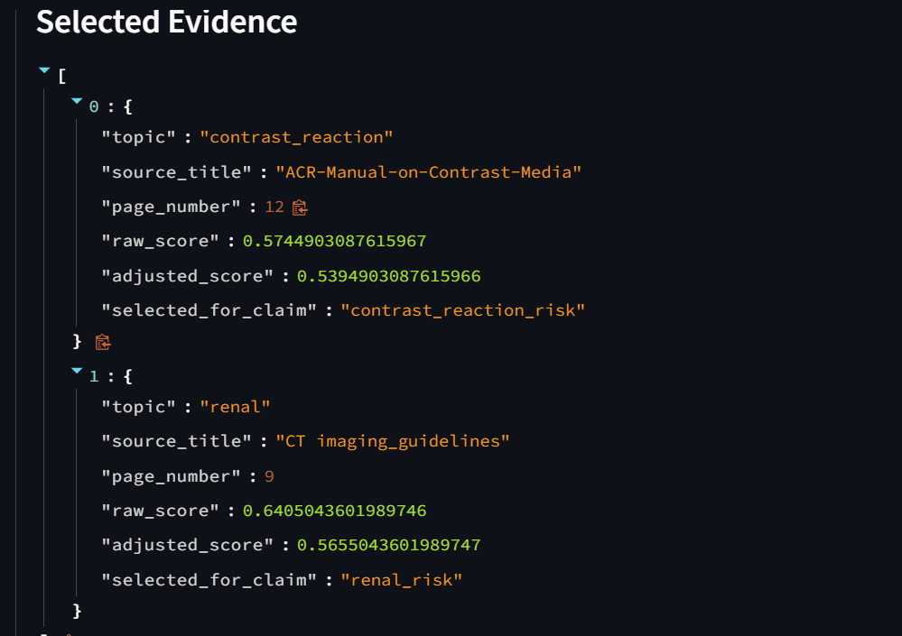
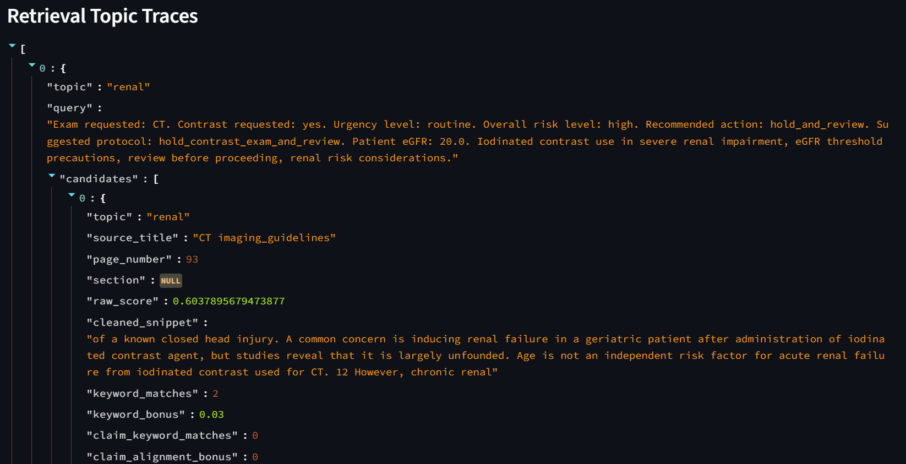

# Radiology Protocol & Risk Decision Support System
## CT Contrast Assistant V1

A deterministic clinical decision-support prototype for CT contrast risk assessment.

This project combines:
- rule-based radiology risk assessment
- topic-aware retrieval over guideline documents
- claim-aware evidence selection
- confidence-aware explanations
- retrieval/debug observability
- structured evaluation with manual evidence-quality review

## Why this project exists

Radiology screening and protocol decisions are often handled through human judgment, paper workflows, and local practice patterns. This project explores how a high-stakes clinical workflow can be made more structured, auditable, and explainable without relying on a freeform chatbot.

Instead of generating decisions directly from an LLM, the system uses deterministic logic for risk classification and retrieval-backed evidence only for explanation and support.

## What the system does

Given a patient case, the system evaluates:

* renal risk
* prior contrast reaction risk
* pregnancy-related risk
* metformin-related precautions
* thyroid-related contrast precautions
* missing screening information
* emergency workflow context
* multi-risk escalation scenarios

It then produces:

* an overall risk level
* a recommended action
* a protocol recommendation
* workflow escalation warnings
* a grounded explanation
* claim-linked citations
* a structured confidence breakdown
* retrieval/debug observability
* operational monitoring traces


## Key features

- **Deterministic decision layer**
  - rule-based handling of renal, pregnancy, contrast reaction, and missing-info scenarios

- **Topic-aware retrieval**
  - focused evidence retrieval by topic instead of one blended search

- **Claim-aware evidence selection**
  - citation selection refined beyond topic relevance toward claim support

- **Confidence breakdown**
  - rule confidence
  - retrieval confidence
  - citation alignment confidence
  - completeness confidence

- **Retrieval observability**
  - candidate-level traces
  - adjusted scores
  - rejection reasons
  - selected evidence trace

## System architecture

### 1. Deterministic Decision Layer
The system first evaluates the case using explicit rules. This decides the risk level and action before any retrieval happens.

## Key features

* **Clinical workflow escalation**

  * emergency override workflow handling
  * multi-risk escalation detection
  * missing-information severity classification
  * structured workflow warnings

* **Operational reliability**

  * structured evaluation suite
  * regression comparison tooling
  * operational case logging
  * confidence-aware monitoring

* **Confidence-aware communication**

  * decomposed confidence scoring
  * weakest-link confidence capping
  * retrieval alignment monitoring
  * missing-information confidence penalties


### 2. Retrieval Layer
Only the clinically relevant topics are queried against the vector store.

### 3. Evidence Selection Layer
Retrieved chunks are reranked with lightweight deterministic scoring using:
- topic keyword matches
- claim alignment bonus
- generic penalty
- adjusted selection score

### 4. Explanation Layer
The explanation is built from rule-based factors first, then grounded with selected supporting citations.

### 5. Confidence Layer
The system computes a structured confidence breakdown instead of relying on a model’s self-reported certainty.

## Example outputs

The app can distinguish between:
- **hold and review**
- **proceed with caution or review**
- **proceed**
- **hold and clarify**

It can also explain why a case was blocked, which topic triggered the decision, and which evidence supported the explanation.

The app can also distinguish between:

* emergency override workflows
* multi-risk escalation cases
* high-severity missing information
* evidence-supported review recommendations

The system communicates:

* why escalation occurred
* which workflow factors triggered caution
* which evidence supported the explanation
* what limited overall confidence


## Evaluation & Observability

This system includes a lightweight evaluation and regression-testing layer for clinical decision support reliability.

### Evaluation Checks

Each test case validates:

- overall risk decision
- recommended action
- expected clinical claims
- expected retrieval topics
- expected evidence source
- expected citation topic
- confidence behavior
- failure type classification

### Debug Traces

Each assessment includes:

- deterministic rule trace
- retrieval queries
- selected guideline evidence
- retrieval topic traces
- confidence breakdown
- human-readable debug summary

### Regression Testing

The system compares:

- `baseline_run.json`
- `latest_run.json`

and generates:

- `comparison_report.json`

to detect pass/fail changes, confidence drops, changed outputs, and regression risks.

## System Design Philosophy

This system prioritizes:

* deterministic workflow reasoning
* conservative decision handling
* auditability and observability
* evidence-backed explanations
* structured confidence communication
* explicit escalation logic

Rather than allowing an LLM to generate unrestricted medical decisions, the system uses deterministic clinical rules as the primary decision layer while retrieval is used to support explanations and evidence grounding.

The project intentionally emphasizes:

* inspectable workflows
* regression testing
* failure visibility
* operational monitoring
* explainable escalation behavior

over unconstrained generative fluency.


## Why this is not a chatbot

This project is not designed as a freeform medical chatbot.

It is designed as a **deterministic decision-support system** where:
- decisions come from explicit rules
- retrieval supports explanations
- evidence selection is inspectable
- confidence is conservative and decomposed
- outputs are easier to audit and test

## Streamlit app

The Streamlit interface includes:
- structured patient case input
- assessment summary
- evidence-backed explanation
- confidence panel
- technical debug view

## Project structure

```text
  radiology-decision-support/
  ├── app/
  │   ├── api/
  │   ├── engines/
  │   ├── rag/
  │   ├── rules/
  │   ├── schemas/
  │   └── services/
  ├── data/
  ├── eval/
  │   └── results/
  ├── logs/
  ├── screenshots/
  ├── scripts/
  ├── streamlit_app.py
  ├── requirements.txt
  └── README.md

```
## Installation

    git clone REA
    cd radiology-decision-support
    python -m venv venv\
    venv\Scripts\activate\
    pip install -r requirements.txt

## Local setup

Create a local secrets file:

    # .streamlit/secrets.toml
    OPENAI_API_KEY = "your_key_here"

Or use a .env file if you prefer local dotenv-based development.

## Run locally
    streamlit run streamlit_app.py

## Deployment (Streamlit Cloud)

This app can be deployed via Streamlit Community Cloud.

### Steps

1. Push this repo to GitHub
2. Go to Streamlit Cloud
3. Select this repository
4. Set entry point to:
   streamlit_app.py
5. Add secrets:

OPENAI_API_KEY="your_key_here"

6. Deploy

### Notes

- Uses FAISS (no external DB required)
- Deterministic decision logic + RAG explanation layer

## Limitations

 - V1 focuses on CT contrast decision support only
 - evidence quality is improved but still not a substitute for full clinical validation
 - this is a portfolio-grade prototype, not a production-certified hospital system
 - adoption in real clinical environments would require workflow integration, policy review, and validation

## Roadmap

- MRI safety / protocol extension
- support for additional modalities
- richer evidence quality evaluation
- better human-readable protocol rendering
- stronger UI polish and case walkthroughs

## Demo Screenshots

### 1. Patient Case Input


### 2. High-Risk Scenario (Renal + Severe Reaction)


### 3. Low-Risk Scenario


### 4. System Debug & Evidence Trace


### 5. System Debug & Evidence Trace


## Author

Built by Paschal Godwin as a portfolio project in deterministic, reliable RAG for healthcare decision support.